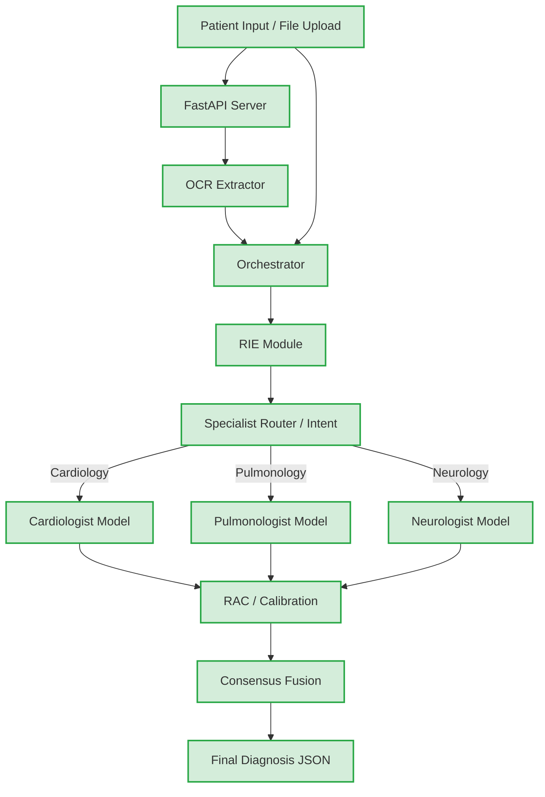

# Project Structure

This document outlines the current HealthInsight architecture and repository layout. The codebase represents a clean, fully offline, agent-based diagnostic pipeline.

## System Architecture



## Directory Layout

```text
HealthInsight/
├── backend/                    # Core Python application logic
│   ├── server.py               # FastAPI entrypoint
│   ├── orchestrator.py         # Main pipeline flow controller
│   ├── ocr_module.py           # File parsing and text extraction
│   ├── rie_module.py           # Rule-based extraction and normalization
│   ├── rac_module.py           # Reliability and Calibration via temperature scaling
│   ├── specialist_router.py    # Intent classifier to pick domain specialist
│   ├── agents/                 # Multi-agent system wrappers
│   ├── config/                 # Small JSON dictionaries (rules, synonyms)
│   ├── utils/                  # Helper scripts and rules engine
│   └── models/                 # ONNX weights (EXCLUDED from git)
├── src/                        # React Frontend Source
│   ├── App.tsx                 # Main Application UI component
│   └── ...
├── services/                   # Frontend logic and API calls
│   └── analysisService.ts      # Integration with backend `/api/analyze`
├── tests/                      # Validation tests for modules
│   ├── test_ocr.py             # Unit tests for OCR
│   └── test_specialist_integration.py # E2E tests for the routing and agent pipeline
├── main.py                     # Entrypoint for running offline evaluations
├── package.json                # Frontend package configuration
├── requirements.txt            # Python environment dependencies
└── README.md                   # Project documentation
```

**Note:** Model weights are intentionally external to the Git repository and are mounted under `backend/models/`. The repository should remain usable as a source-code distribution without committing the large model binaries.

### Design Principles
- **No Cloud Dependencies:** Complete offline operability using quantized ONNX models.
- **Traceability:** Rule-Based Information Extraction (RIE) ensures token-to-diagnosis mapping.
- **Modularity:** Easy onboarding of new domain specialists without disrupting the Orchestrator flow.
